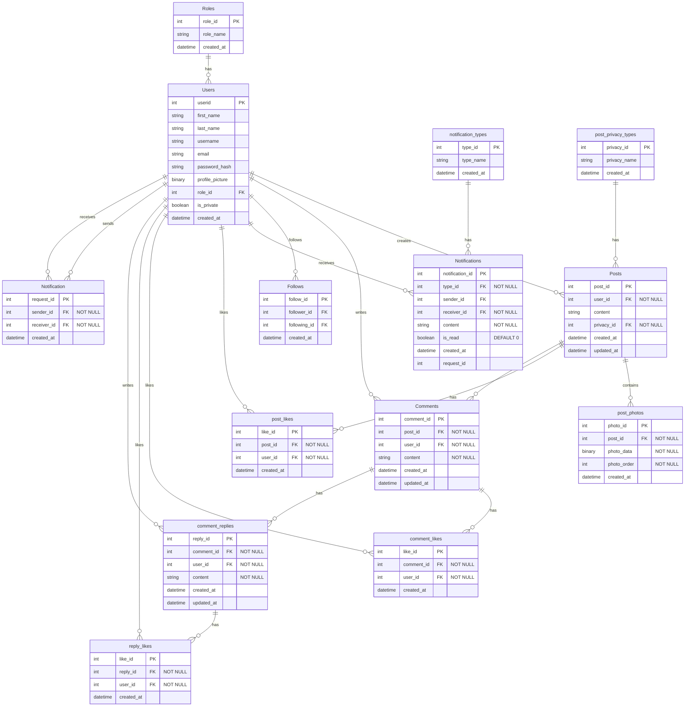

# İleri Java Uygulamaları Springboot Web Projesi

| Kategori | Bilgi | Detay |
|----------|-------|-------|
| Öğrenci Bilgileri | Ad Soyad | Senai Sinan Sungur |
| | Öğrenci Numarası | HR230026 |
| | E-posta | senai.sungur@std.medipol.edu.tr |
| Üniversite Bilgileri | Üniversite | İstanbul Medipol Üniversitesi |
| | Fakülte/Yüksekokul | Meslek Yüksekokulu |
| | Bölüm | Bilgisayar Programcılığı |
| | Program | İkinci Öğretim |
| | Sınıf | 2. Sınıf |
| Akademik Bilgiler | Ders | İleri Java Uygulamaları |
| | Ders Kodu | 24-25.HR.BPR2260500 |
| | Öğretim Görevlisi | Hüseyin Kınay |
| | Dönem | 2024-2025 Bahar Yarıyılı |
| Proje Bilgileri | Proje Türü | Final Projesi |
| | Teslim Tarihi | 12 Haziran 2025 |
| | Proje Konusu | Sosyal Medya Uygulaması |
| | Kullanılan Teknolojiler | Spring Boot, Java 24, PostgreSQL, Thymeleaf |

Bu repo, yukarıdaki bilgiler doğrultusunda hazırlanmış bir Springboot projesidir.

## Proje Yapısı

```
senaisinansungur/
├── src/
│   ├── main/
│   │   ├── java/
│   │   │   └── org/
│   │   │       └── example/
│   │   │           ├── config/         # Yapılandırma sınıfları
│   │   │           ├── controller/     # REST API kontrolcüleri
│   │   │           ├── dto/            # Veri transfer nesneleri
│   │   │           ├── entity/         # Veritabanı entity sınıfları
│   │   │           ├── repository/     # JPA repository arayüzleri
│   │   │           ├── service/        # İş mantığı servisleri
│   │   │           └── Application.java
│   │   └── resources/
│   │       ├── static/                 # Statik dosyalar (CSS, JS, resimler)
│   │       ├── templates/              # Thymeleaf şablonları
│   │       └── application.properties  # Uygulama yapılandırması
│   └── test/                          # Test sınıfları
├── uploads/                           # Yüklenen dosyalar
├── database.sql                       # Veritabanı şeması
├── pom.xml                           # Maven bağımlılıkları
└── README.md                         # Proje dokümantasyonu
```

## Kurulum

### Gereksinimler
- JDK 24
- Maven 3.0.0
- PostgreSQL 15 veya üzeri
- IntelliJ IDEA (önerilen)

### Adımlar

1. **Projeyi Klonlayın**
   ```bash
   git clone https://github.com/kullaniciadi/senaisinansungur.git
   cd senaisinansungur
   ```

2. **Veritabanını Kurun**
   - PostgreSQL kurulu değilse [buradan](https://www.postgresql.org/download/) indirin ve kurun
   - pgAdmin veya komut satırı ile yeni bir veritabanı oluşturun (örn: `senaisinansungur`)
   - `database.sql` dosyasını çalıştırın
   - Kullanıcı adı ve şifreyi not edin (örn: kullanıcı: `postgres`, şifre: `postgres`)
   - **Not:** Eğer sunucunuz uzaktaysa veya domain üzerinden bağlanacaksanız, pgAdmin'de sunucu adresi olarak `sensinsung.me` kullanabilirsiniz.

3. **Proje Ayarlarını Yapın**
   - `src/main/resources/application.properties` dosyasını açın
   - Veritabanı bağlantı ayarlarını aşağıdaki gibi düzenleyin:
     ```properties
     # Yerel bağlantı için
     spring.datasource.url=jdbc:postgresql://localhost:5432/senaisinansungur
     # Domain üzerinden bağlantı için
     # spring.datasource.url=jdbc:postgresql://sensinsung.me:5432/senaisinansungur
     spring.datasource.username=postgres
     spring.datasource.password=postgres
     spring.datasource.driver-class-name=org.postgresql.Driver
     spring.jpa.database-platform=org.hibernate.dialect.PostgreSQLDialect
     ```

4. **Bağımlılıkları Yükleyin**
   ```bash
   mvn clean install
   ```

5. **Uygulamayı Çalıştırın**
   ```bash
   mvn spring-boot:run
   ```
   veya
   - IntelliJ IDEA'da `Application.java` dosyasını açın
   - Run butonuna tıklayın

6. **Uygulamaya Erişin**
   - Tarayıcınızda `http://localhost:8080` veya domain üzerinden `https://sensinsung.me` adresine gidin

## API Dökümantasyonu

### Kullanıcı İşlemleri

#### Kayıt Ol
```http
POST /api/auth/register
Content-Type: application/json

{
    "firstName": "Ad",
    "lastName": "Soyad",
    "username": "kullaniciadi",
    "email": "email@example.com",
    "password": "sifre123"
}
```

**Başarılı Yanıt (201 Created)**
```json
{
    "userId": 1,
    "firstName": "Ad",
    "lastName": "Soyad",
    "username": "kullaniciadi",
    "email": "email@example.com",
    "createdAt": "2025-06-10T14:30:00"
}
```

#### Giriş Yap
```http
POST /api/auth/login
Content-Type: application/json

{
    "username": "kullaniciadi",
    "password": "sifre123"
}
```

**Başarılı Yanıt (200 OK)**
```json
{
    "token": "eyJhbGciOiJIUzI1NiIsInR5cCI6IkpXVCJ9...",
    "user": {
        "userId": 1,
        "firstName": "Ad",
        "lastName": "Soyad",
        "username": "kullaniciadi",
        "email": "email@example.com"
    }
}
```

### Profil İşlemleri

#### Profil Bilgilerini Güncelle
```http
PUT /api/profile
Content-Type: application/json
Authorization: Bearer {token}

{
    "firstName": "Yeni Ad",
    "lastName": "Yeni Soyad",
    "isPrivate": true
}
```

**Başarılı Yanıt (200 OK)**
```json
{
    "userId": 1,
    "firstName": "Yeni Ad",
    "lastName": "Yeni Soyad",
    "username": "kullaniciadi",
    "email": "email@example.com",
    "isPrivate": true,
    "updatedAt": "2025-06-10T15:30:00"
}
```

#### Profil Fotoğrafı Yükle
```http
POST /api/profile/photo
Content-Type: multipart/form-data
Authorization: Bearer {token}

file: [dosya]
```

**Başarılı Yanıt (200 OK)**
```json
{
    "userId": 1,
    "photoUrl": "/uploads/profile/1/profile.jpg",
    "updatedAt": "2025-06-10T15:35:00"
}
```

### Gönderi İşlemleri

#### Gönderi Oluştur
```http
POST /api/posts
Content-Type: multipart/form-data
Authorization: Bearer {token}

content: "Gönderi içeriği"
privacyId: 1
files: [dosyalar]
```

**Başarılı Yanıt (201 Created)**
```json
{
    "postId": 1,
    "content": "Gönderi içeriği",
    "userId": 1,
    "username": "kullaniciadi",
    "privacyId": 1,
    "photos": [
        {
            "photoId": 1,
            "photoUrl": "/uploads/posts/1/photo1.jpg"
        }
    ],
    "createdAt": "2025-06-10T16:00:00"
}
```

#### Gönderi Listele
```http
GET /api/posts
Authorization: Bearer {token}
```

**Başarılı Yanıt (200 OK)**
```json
{
    "posts": [
        {
            "postId": 1,
            "content": "Gönderi içeriği",
            "userId": 1,
            "username": "kullaniciadi",
            "privacyId": 1,
            "photos": [
                {
                    "photoId": 1,
                    "photoUrl": "/uploads/posts/1/photo1.jpg"
                }
            ],
            "likeCount": 5,
            "commentCount": 3,
            "createdAt": "2025-06-10T16:00:00"
        }
    ],
    "totalPages": 1,
    "currentPage": 0,
    "totalElements": 1
}
```

#### Gönderi Beğen
```http
POST /api/posts/{postId}/like
Authorization: Bearer {token}
```

**Başarılı Yanıt (200 OK)**
```json
{
    "postId": 1,
    "likeCount": 6,
    "isLiked": true
}
```

### Yorum İşlemleri

#### Yorum Ekle
```http
POST /api/posts/{postId}/comments
Content-Type: application/json
Authorization: Bearer {token}

{
    "content": "Yorum içeriği"
}
```

**Başarılı Yanıt (201 Created)**
```json
{
    "commentId": 1,
    "content": "Yorum içeriği",
    "postId": 1,
    "userId": 1,
    "username": "kullaniciadi",
    "createdAt": "2025-06-10T16:30:00"
}
```

#### Yorumları Listele
```http
GET /api/posts/{postId}/comments
Authorization: Bearer {token}
```

**Başarılı Yanıt (200 OK)**
```json
{
    "comments": [
        {
            "commentId": 1,
            "content": "Yorum içeriği",
            "postId": 1,
            "userId": 1,
            "username": "kullaniciadi",
            "likeCount": 2,
            "replyCount": 1,
            "createdAt": "2025-06-10T16:30:00"
        }
    ],
    "totalPages": 1,
    "currentPage": 0,
    "totalElements": 1
}
```

### Takip İşlemleri

#### Kullanıcı Takip Et
```http
POST /api/follow/{userId}
Authorization: Bearer {token}
```

**Başarılı Yanıt (200 OK)**
```json
{
    "followerId": 1,
    "followingId": 2,
    "status": "FOLLOWING"
}
```

#### Takipçileri Listele
```http
GET /api/followers
Authorization: Bearer {token}
```

**Başarılı Yanıt (200 OK)**
```json
{
    "followers": [
        {
            "userId": 2,
            "username": "takipci1",
            "firstName": "Takipçi",
            "lastName": "Bir",
            "photoUrl": "/uploads/profile/2/profile.jpg"
        }
    ],
    "totalPages": 1,
    "currentPage": 0,
    "totalElements": 1
}
```

#### Takip Edilenleri Listele
```http
GET /api/following
Authorization: Bearer {token}
```

**Başarılı Yanıt (200 OK)**
```json
{
    "following": [
        {
            "userId": 3,
            "username": "takipedilen1",
            "firstName": "Takip",
            "lastName": "Edilen",
            "photoUrl": "/uploads/profile/3/profile.jpg"
        }
    ],
    "totalPages": 1,
    "currentPage": 0,
    "totalElements": 1
}
```

### Bildirim İşlemleri

#### Bildirimleri Listele
```http
GET /api/notifications
Authorization: Bearer {token}
```

**Başarılı Yanıt (200 OK)**
```json
{
    "notifications": [
        {
            "notificationId": 1,
            "type": "FOLLOW",
            "content": "kullaniciadi sizi takip etmeye başladı",
            "senderId": 2,
            "senderUsername": "takipci1",
            "isRead": false,
            "createdAt": "2025-06-10T17:00:00"
        }
    ],
    "totalPages": 1,
    "currentPage": 0,
    "totalElements": 1
}
```

#### Bildirimi Okundu İşaretle
```http
PUT /api/notifications/{notificationId}/read
Authorization: Bearer {token}
```

**Başarılı Yanıt (200 OK)**
```json
{
    "notificationId": 1,
    "isRead": true,
    "updatedAt": "2025-06-10T17:30:00"
}
```

## Proje Özellikleri

### Kullanıcı Yönetimi
- Kayıt olma ve giriş yapma
- Profil düzenleme
- Profil fotoğrafı yükleme
- Şifre değiştirme
- Hesap gizlilik ayarları

### Gönderi İşlemleri
- Metin ve fotoğraf içeren gönderiler oluşturma
- Gönderi düzenleme ve silme
- Gönderi gizlilik ayarları (Herkese Açık, Sadece Takipçiler, Gizli)
- Gönderi beğenme ve beğeniyi geri çekme
- Gönderi paylaşma

### Yorum Sistemi
- Gönderilere yorum yapma
- Yorumları düzenleme ve silme
- Yorumlara yanıt verme
- Yorum beğenme

### Takip Sistemi
- Kullanıcıları takip etme
- Takibi bırakma
- Takipçi ve takip edilen listesi
- Takip istekleri (gizli profiller için)

### Bildirim Sistemi
- Takip bildirimleri
- Okunmamış bildirim sayacı

### Arama ve Keşfet
- Kullanıcı arama

### Güvenlik
- JWT tabanlı kimlik doğrulama
- Şifre şifreleme
- Oturum yönetimi
- Güvenli dosya yükleme
- XSS ve CSRF koruması

### Performans
- Sayfalama (pagination)
- Önbellek (caching)
- Lazy loading
- Resim optimizasyonu
- Veritabanı indeksleme

## Sürüm Bilgileri
- Java: 24
- Spring Boot: 3.5.0
- PostgreSQL JDBC Driver: 42.7.3
- Maven: 3.0.0
- PostgreSQL: 15 veya üzeri
- PostgreSQL Port: 5432 (varsayılan)
- Uygulama Port: 8080 (varsayılan)
- Geliştirme Ortamı: IntelliJ IDEA

## Veritabanı Bağlantı Bilgileri
- Veritabanı Adı: senaisinansungur
- Kullanıcı Adı: postgres
- Şifre: postgres
- Sunucu: localhost veya sensinsung.me
- Port: 5432

> **Not:** Veritabanı şeması için [database.sql](database.sql) dosyasına bakabilirsiniz.

## Veritabanı Diyagramı



> - UserFollowersCount
> - UserFollowingCount
> - UserFollowers
> - UserFollowing
> - UserProfile
> - UnreadNotificationsCount
> - PostPhotoCount
> - PostLikeCount
> - CommentLikeCount
> - ReplyLikeCount
> - PostVisibility

## Teknolojiler

### Backend
- **Java 24**: Programlama dili
- **Spring Boot 3.5.0**: Web uygulaması framework'ü
  - Spring Web: Web sayfaları ve API'ler için
  - Spring Security: Kullanıcı girişi ve güvenlik
  - Spring Data JPA: Veritabanı işlemleri
  - Spring Boot DevTools: Geliştirme kolaylığı

### Frontend
- **Thymeleaf**: Web sayfası şablonları
  - Thymeleaf Extras Spring Security: Güvenlik özellikleri
  - Bootstrap: Sayfa tasarımı

### Veritabanı
- **PostgreSQL**: Veritabanı sistemi
  - PostgreSQL JDBC Driver: Veritabanı bağlantısı

### Geliştirme Araçları
- **IntelliJ IDEA**: Geliştirme ortamı
- **Maven**: Proje yönetimi
- **Lombok**: Kod kısaltma
- **Spring Boot Test**: Test araçları

### Güvenlik
- Kullanıcı girişi
- Yetkilendirme
- Oturum yönetimi

## Özellikler

- **Kullanıcı Kayıt ve Giriş:** Kullanıcılar sisteme kayıt olabilir ve güvenli şekilde giriş yapabilir.
  > **Not:** Kullanıcı işlemleri için [UserController.java](src/main/java/org/example/controller/UserController.java) ve [UserService.java](src/main/java/org/example/service/UserService.java) dosyalarına bakabilirsiniz.

- **Profil Yönetimi:** Kullanıcılar profil bilgilerini güncelleyebilir, profil fotoğrafı ekleyebilir.
  > **Not:** Profil işlemleri için [ProfileController.java](src/main/java/org/example/controller/ProfileController.java) ve [ProfileService.java](src/main/java/org/example/service/ProfileService.java) dosyalarına bakabilirsiniz.

- **Takip Sistemi:** Kullanıcılar birbirini takip edebilir, takip istekleri gönderebilir ve takipçi listelerini görebilir.
  > **Not:** Takip işlemleri için [FollowController.java](src/main/java/org/example/controller/FollowController.java) ve [FollowService.java](src/main/java/org/example/service/FollowService.java) dosyalarına bakabilirsiniz.

- **Gizlilik Ayarları:** Kullanıcılar profillerini gizli veya herkese açık yapabilir.
  > **Not:** Gizlilik ayarları için [PrivacyController.java](src/main/java/org/example/controller/PrivacyController.java) ve [PrivacyService.java](src/main/java/org/example/service/PrivacyService.java) dosyalarına bakabilirsiniz.

- **Bildirimler:** Takip istekleri ve diğer önemli olaylar için bildirimler alınabilir.
  > **Not:** Bildirim işlemleri için [NotificationController.java](src/main/java/org/example/controller/NotificationController.java) ve [NotificationService.java](src/main/java/org/example/service/NotificationService.java) dosyalarına bakabilirsiniz.

- **Gönderi Paylaşımı:** Kullanıcılar metin ve fotoğraf içeren gönderiler oluşturabilir.
  > **Not:** Gönderi işlemleri için [PostController.java](src/main/java/org/example/controller/PostController.java) ve [PostService.java](src/main/java/org/example/service/PostService.java) dosyalarına bakabilirsiniz.

- **Gönderi Gizliliği:** Gönderiler herkese açık, sadece arkadaşlar veya özel olarak paylaşılabilir.
  > **Not:** Gönderi gizlilik ayarları için [PostPrivacyController.java](src/main/java/org/example/controller/PostPrivacyController.java) ve [PostPrivacyService.java](src/main/java/org/example/service/PostPrivacyService.java) dosyalarına bakabilirsiniz.

- **Beğeni ve Yorum:** Gönderilere ve yorumlara beğeni bırakılabilir, gönderilere ve yorumlara yanıt yazılabilir.
  > **Not:** Beğeni ve yorum işlemleri için [LikeController.java](src/main/java/org/example/controller/LikeController.java), [CommentController.java](src/main/java/org/example/controller/CommentController.java) ve ilgili servis dosyalarına bakabilirsiniz.

- **SQL Server Entegrasyonu:** Tüm veriler Microsoft SQL Server üzerinde saklanır.
  > **Not:** Veritabanı şeması ve yapılandırması için [database.sql](database.sql) ve [application.properties](src/main/resources/application.properties) dosyalarına bakabilirsiniz.

- **Rol Tabanlı Yetkilendirme:** Kullanıcılar farklı rollerle (admin, kullanıcı) sisteme erişebilir.
  > **Not:** Rol ve yetkilendirme işlemleri için [SecurityConfig.java](src/main/java/org/example/config/SecurityConfig.java) ve [RoleController.java](src/main/java/org/example/controller/RoleController.java) dosyalarına bakabilirsiniz.

- **Modern ve Güvenli Altyapı:** Spring Security ile güvenlik, JPA ile veritabanı işlemleri, Thymeleaf ile dinamik arayüz.
  > **Not:** Proje yapılandırması için [pom.xml](pom.xml) ve [application.properties](src/main/resources/application.properties) dosyalarına bakabilirsiniz.
